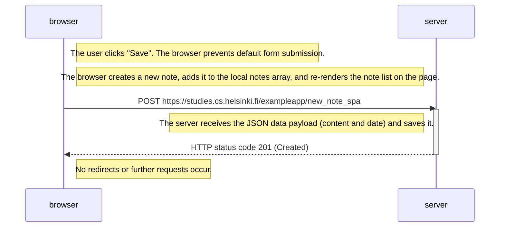

```mermaid

sequenceDiagram
    participant browser
    participant server

    Note right of browser: The user clicks "Save". The browser prevents default form submission.
    Note right of browser: The browser creates a new note, adds it to the local notes array, and re-renders the note list on the page.

    browser->>server: POST https://studies.cs.helsinki.fi/exampleapp/new_note_spa
    activate server
    Note left of server: The server receives the JSON data payload (content and date) and saves it.
    server-->>browser: HTTP status code 201 (Created)
    deactivate server
    
    Note right of browser: No redirects or further requests occur.
    
```
